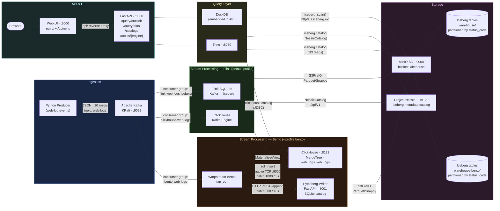
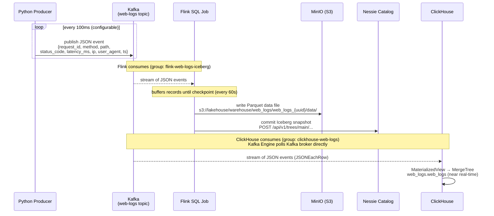

# Local Lakehouse — Architecture

## Component Diagram

> **Streaming profiles are mutually exclusive.**
> Default (`docker compose up`): Flink + ClickHouse Kafka Engine.
> Alternative (`docker compose --profile bento up`): Bento + PyIceberg Writer.

---

## Sequence Diagram — Data Ingestion Flow (Flink)

---

## Sequence Diagram — Data Ingestion Flow (Bento)

```mermaid
sequenceDiagram
  participant P as Python Producer
  participant K as Kafka<br/>(web-logs topic)
  participant B as Warpstream Bento
  participant CH as ClickHouse<br/>(:8123)
  participant PIW as PyIceberg Writer<br/>(:8001)
  participant M as MinIO (S3)

  loop every 100ms (configurable)
    P->>K: publish JSON event<br/>{request_id, method, path,<br/>status_code, latency_ms, ip, user_agent, ts}
  end

  Note over K,B: Bento consumes (group: bento-web-logs)

  K-->>B: stream of JSON events
  Note over B: fan_out — writes to both sinks in parallel

  rect rgb(40, 30, 15)
    Note over B,CH: ClickHouse sink — sql_insert via native TCP :9000
    B->>CH: batch INSERT (up to 1 000 records or 5s)<br/>direct sql_insert into web_logs.web_logs
  end

  rect rgb(20, 30, 40)
    Note over B,M: Iceberg sink — HTTP → PyIceberg Writer → MinIO
    B->>PIW: POST /append<br/>JSON array (up to 500 records or 10s)
    Note over PIW: converts to Arrow table<br/>appends to Iceberg table (SQLite catalog)
    PIW->>M: write Parquet data file<br/>s3://lakehouse/warehouse-bento/web_logs/...
    PIW-->>B: {"status": "ok", "count": N}
  end
```

---

## Sequence Diagram — Query Flow

```mermaid
sequenceDiagram
  participant B as Browser
  participant UI as Web UI<br/>(nginx :3000)
  participant API as FastAPI<br/>(:8000)
  participant DDB as DuckDB<br/>(embedded)
  participant T as Trino<br/>(:8080)
  participant M as MinIO<br/>(:9000)
  participant N as Nessie<br/>(:19120)
  participant CH as ClickHouse<br/>(:8123)

  B->>UI: GET http://localhost:3000/
  UI->>API: GET /api/tables/duckdb
  UI->>API: GET /api/tables/trino
  Note over API,DDB: DuckDB lists registered views<br/>auto-discovered from MinIO on startup
  Note over API,T: Trino queries information_schema<br/>for iceberg + clickhouse catalogs
  API-->>UI: table lists for schema browser
  UI-->>B: render schema browser (left sidebar)

  rect rgb(30, 50, 30)
    Note over B,M: DuckDB query path
    B->>UI: execute SQL (DuckDB engine selected)
    UI->>API: POST /api/query/duckdb {sql, limit}
    API->>DDB: execute(sql) [thread-safe lock]
    DDB->>M: iceberg_scan('s3://lakehouse/warehouse/...')<br/>reads Parquet files directly via httpfs
    M-->>DDB: Parquet column chunks
    DDB-->>API: {columns, rows, row_count, elapsed_ms}
    API-->>UI: QueryResponse JSON
    UI-->>B: render results table with pagination
  end

  rect rgb(30, 30, 50)
    Note over B,CH: Trino federated query path
    B->>UI: execute SQL (Trino engine selected)
    UI->>API: POST /api/query/trino {sql, limit}
    API->>T: DBAPI connect() + cursor.execute(sql)
    T->>N: resolve Iceberg table metadata<br/>(NessieCatalog → /api/v1)
    T->>M: read Parquet data files (S3 via hive.s3.*)
    T->>CH: JDBC query for clickhouse catalog tables
    T-->>API: result cursor → fetchall()
    API-->>UI: QueryResponse JSON
    UI-->>B: render results table with pagination
  end
```

---

## Port Reference

| Port | Service | Protocol | Purpose |
|---|---|---|---|
| 9092 | Kafka | TCP | PLAINTEXT — internal Docker clients (Flink, Bento, producer) |
| 9094 | Kafka | TCP | HOST listener — host-side access (kcat, tests) |
| 9000 | MinIO | HTTP | S3 API — Flink S3FileIO, DuckDB httpfs, Trino, PyIceberg Writer |
| 9001 | MinIO | HTTP | MinIO Console UI |
| 19120 | Nessie | HTTP | Nessie REST API v1/v2 + Iceberg catalog metadata (Flink path) |
| 8123 | ClickHouse | HTTP | HTTP query API, JDBC (Trino clickhouse connector) |
| 8082 | Flink | HTTP | Flink Web UI + REST API (JobManager) |
| 8080 | Trino | HTTP | Trino REST API + Web UI |
| 8001 | PyIceberg Writer | HTTP | `POST /append` (called by Bento), `GET /health` — bento profile only |
| 8000 | FastAPI | HTTP | REST API (`/query/*`, `/catalogs`, `/tables/*`) |
| 3000 | Web UI | HTTP | SQL workbench (nginx serving static files) |

---

## Technology Stack

| Layer | Technology | Version | Role |
|---|---|---|---|
| Message Broker | Apache Kafka (KRaft) | 3.9.0 | Event streaming, no ZooKeeper |
| Producer | Python + confluent-kafka | 3.12 / 2.7.0 | Generates synthetic web-log events |
| Stream Processor (default) | Apache Flink (SQL) | 1.20 | Kafka → Iceberg streaming |
| Stream Processor (bento) | Warpstream Bento | latest | Kafka → ClickHouse + Iceberg (lightweight alternative to Flink) |
| Iceberg Writer (bento) | PyIceberg Writer (FastAPI) | — | Receives JSON batches from Bento; appends to Iceberg via PyIceberg + SQLite catalog |
| Table Format | Apache Iceberg | 1.7.2 | Open table format on object store |
| Catalog (default) | Project Nessie | 0.76.6 | Iceberg metadata catalog (git-like), used by Flink path |
| Catalog (bento) | SQLite (embedded) | — | Ephemeral local catalog used by PyIceberg Writer |
| Object Store | MinIO | 24.8 | S3-compatible local storage |
| Analytics DB | ClickHouse | 24.8 | OLAP; fed by Kafka Engine (default) or Bento sql_insert (bento) |
| Federated SQL | Trino | 450 | Cross-catalog joins (Iceberg + ClickHouse) |
| Embedded SQL | DuckDB | 1.2.2 | Iceberg direct read via httpfs |
| API | FastAPI + uvicorn | 0.115 / 0.34 | REST gateway for query engines |
| Web UI | Alpine.js + nginx | 3.x / alpine | SQL workbench SPA |
| Orchestration | Docker Compose v2 | — | Local environment management |
